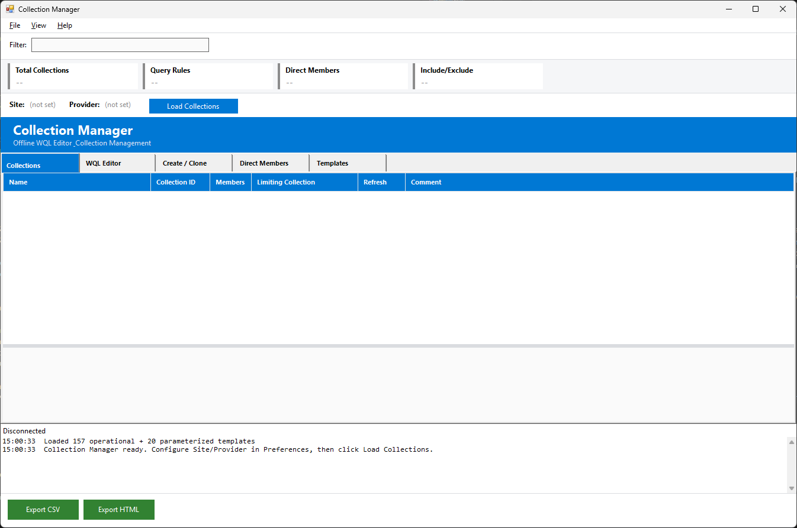

# Collection Manager

A WinForms-based PowerShell GUI for managing MECM (Configuration Manager) device collections with an offline WQL editor. Bypass the slow console query editor -- load all collections into a local grid, edit WQL queries in a fast monospace editor, validate, preview results, and apply changes in bulk.

Includes a template library with 155 ready-made operational queries and 20 parameterized WQL templates.



## Requirements

- Windows 10/11
- PowerShell 5.1
- .NET Framework 4.8+
- Configuration Manager console installed

## Quick Start

```powershell
powershell -ExecutionPolicy Bypass -File start-collectionmanager.ps1
```

1. Open **File > Preferences** and set your Site Code and SMS Provider
2. Click **Load Collections**
3. Use the tabs: Collections, WQL Editor, Create/Clone, Direct Members, Templates

## Features

### Collections Tab

Master-detail view of all device collections with:
- Name, Collection ID, Member Count, Limiting Collection, Refresh Type, Comment
- Text filter across name, ID, and comment
- Detail panel on row selection

### WQL Editor Tab

The primary workflow for fast query editing:
1. Select a collection from the dropdown
2. Select a query rule from the list
3. Edit the WQL in the monospace editor
4. Click **Validate Query** to test via `Invoke-CMWmiQuery`
5. Click **Preview Results** to see matching devices
6. Click **Update Rule** to apply the change

Also supports adding new rules and removing existing ones.

### Create / Clone Tab

- Create new device collections with name, limiting collection, comment, and refresh type
- Clone existing collections via `Copy-CMCollection`

### Direct Members Tab

- Load current members of any collection
- Add devices by name (one per line, auto-resolves ResourceId)
- Remove selected members

### Templates Tab

TreeView with two categories:

- **Ready-Made (155)** -- operational queries organized by category (Clients, Workstations, Servers, OS, Hardware, Office 365, etc.)
- **Parameterized (20)** -- templates with fill-in-the-blank parameters that generate complete WQL

Select a template, fill in parameters, preview the generated WQL, then either copy to the WQL Editor or create a collection directly from the template.

### Template Categories

**Ready-made**: Clients, Clients Version, Hardware Inventory, Laptops, Mobile Devices, Office 365 Build/Channel, Others, SCCM Infrastructure, Servers, Software Inventory, System Health, Systems, Windows Update Agent, Workstations

**Parameterized**: Software (Installed/Not Installed by Name, Version), OS Build, Client Version, Manufacturer, Model, HW/SW Inventory Reporting, AD OU, Created Within N Days, Chassis Type, TPM, Disk Space, RAM, IP Subnet, Domain, BIOS Version, BitLocker, Last Boot

## Project Structure

```
collectionmanager/
├── start-collectionmanager.ps1                # WinForms GUI
├── Module/
│   ├── CollectionManagerCommon.psd1           # Module manifest
│   ├── CollectionManagerCommon.psm1           # Business logic (27 functions)
│   └── CollectionManagerCommon.Tests.ps1      # Pester 5.x tests (22 tests)
├── Templates/
│   ├── operational-collections.json           # 155 ready-made queries
│   └── parameterized-templates.json           # 20 parameterized templates
├── Logs/                                       # Session logs
├── Reports/                                    # Export output
├── CollectionManager.prefs.json               # User preferences
├── CollectionManager.windowstate.json         # Window state persistence
├── CHANGELOG.md
├── LICENSE
└── README.md
```

## Tests

22 Pester 5.x tests covering logging, template loading, parameter expansion, and export.

```powershell
cd Module
Invoke-Pester .\CollectionManagerCommon.Tests.ps1
```

## Safety

- Built-in collections (SMS* prefix) cannot be deleted
- Confirmation dialogs before destructive operations
- WQL validation before applying query rules

## License

See [LICENSE](LICENSE) file.

## Author

Jason Ulbright

## Credits

Ready-made operational collection queries adapted from [SystemCenterDudes](https://www.systemcenterdudes.com/create-operational-sccm-collection-using-powershell-script/) / [prae1809/PowerShell-Scripts](https://github.com/prae1809/PowerShell-Scripts/tree/master/OperationalCollections).
